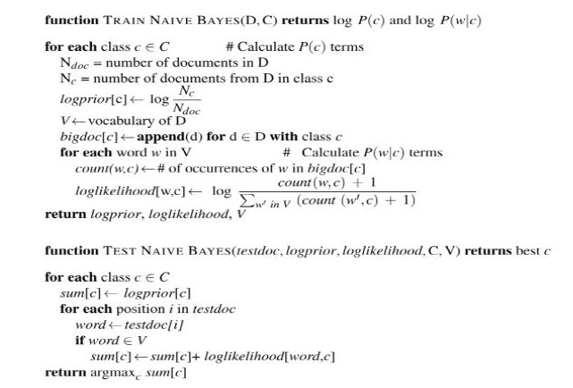

<h1>Spam Detector</h1>

<p>
  This is a Spam/Ham detector using Naive Bayes classifier implemented from scratch in Python3. 

  This is a text classification problem. Naive Bayes makes two assumptions:
  
  - bag of words assumption which assumes that positions do not matter.
  - conditional independence which assumes that feature probabilities are independent for a given class (e.g. spam/ham).
       
  The following image shows the Naive Bayes Algorithm for training and testing text classification:
  


<br>
  
   At the end, classification performance report is generated showing confusion matrix, accuracy, precision, recall and f1-score.
  It is currently trained on Enron dataset. However, it can be trained on any other email dataset by changing respective paths.
</p>

<hr>

## Usage 🔧

Program requires paths to train and test folders which further contain spam and ham folders having respective files
to make datasets.

In Spam Ham Email Classification.ipynb, cell#5 contains the following code:

```
makeDatasets('train/spam', 'train/ham', 'test/spam', 'test/ham')
```
These are the paths to dataset files. Change these paths to train on any other dataset.
<hr>

## Author 👋

You can get in touch with me on my LinkedIn Profile:

#### Ahmad Shafique

[](https://www.linkedin.com/in/ahmad-shafique)

You can also follow my GitHub Profile to stay updated about my latest projects: [](https://github.com/ahmadshafique)


If you liked the repo then please support it by giving it a star ⭐!

<hr>

## Contributions Welcome ✨


If you find any bug in the code or have any improvements in mind then feel free to generate a pull request.

<hr>

## License 📄

[](LICENSE)

Copyright (c) 2020, Ahmad Shafique
